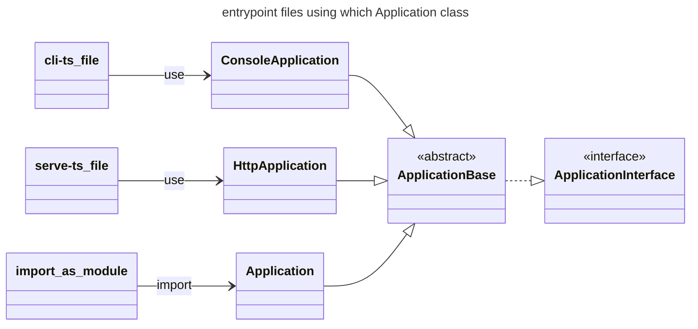

## indexes

make static index if you need.

But IMO, if you feel the document will have been large/huge, then we use anyone document generation tool(e.g. [Docusaurus](https://docusaurus.io/docs)) and that may auto-generate index.
目次が必要になるほどドキュメントが大きくなったら、そもそもドキュメント生成ツールを使うべきフェーズだよね。

## entrypoint files implementation

